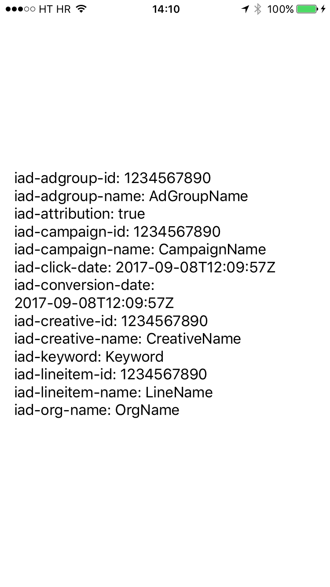

# SearchAdsImplementationDemo

Demo project that shows how to create a native iOS app that can read [Search Ads Attribution API information](https://searchads.apple.com/help/pdf/attribution-api.pdf).

You can check out the step by step tutorial on how to do this [here](http://www.nikola-breznjak.com/blog/ios/create-native-ios-app-can-read-search-ads-attribution-api-information/).

